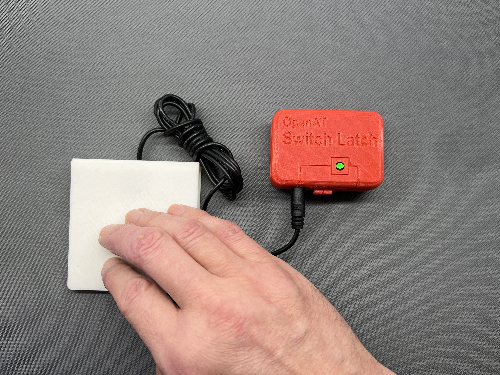

# OpenAT-Switch-Latch 
The OpenAT-Switch-Latch intended to convert a momentary switch input into a toggle switch output. The device was developed as several assistive switch users requested the ability to 
control lights and other devices in a semi-permanent manner, but do so, utilizing their preferred 
momentary assistive switches.

## Usage
To use the Switch Latch, a momentary switch is plugged into the 3.5 mm input jack. A switch adapted 
device is then plugged into the 3.5 mm output jack. The power switch must be enabled to use the 
device. However, the device will turn itself off if there is no plug inserted into the input jack.

## More info at
- [Makers Making Change Project Page](https://makersmakingchange.com/project/openat-switch-latch/)
- [Makers Making Change Forum Thread](https://makersmakingchange.com/forum/topic/openat-switch-latch/)

## How to Obtain a OpenAT-Switch-Latch
### 1. Do it Yourself (DIY) or Do it Together (DIT)

This is an open-source assistive technology, so anyone is free to build it. All of the files and instructions required to build the OpenAT-Switch-Latch are contained within this repository. Refer to the Maker Checklist below.

### 2. Request a build of this device

If you would like to obtain a OpenAT-Switch-Latch , you may submit a build request through the [MMC Library Page](https://makersmakingchange.com/project/openat-switch-latch/). The requestor is responsible for the cost of materials and any shipping.

### 3. How to build this device for someone else

If you have the skills and equipment to build this device, and would like to donate your time to create the switch for someone who needs it, visit the [MMC Maker Wanted](https://makersmakingchange.com/maker-wanted/) section.

## Getting Started

### 1. Read the Makers Checklist

The [Makers Checklist](/Documentation/OpenAT_Switch_Latch_Maker_Checklist_v1.0.pdf) provides an overview of the steps required to build this device.

### 2. Order the Off-The-Shelf Components

The [Bill of Materials](/Documentation/OpenAT_Switch_Latch_BOM_v1.0.xlsx) lists all of the parts and components required to build the OpenAT-Switch-Latch. The main switch component needs to be ordered online. The rest of the off-the-shelf components are also online or may be available in smaller quantities at your local hardware store or dollar store.

### 3. Order the PCBs

The [Gerber_Files](/Build_Files/PCB_Files/Gerber_Files) includes the PCB build information which can be submitted to PCB fabrication service to create the custom PCB. Please refer to MMC-PCB for more information on custom PCB fabrication.

### 4. Print the 3D Printable components

All of the files and individual print files can be in the [/Build_Files/3D_Printing_Files](/Build_Files/3D_Printing_Files/) folder.

### 5. Assemble the OpenAT-Switch-Latch

Reference the [Assembly Guide](/Documentation/OpenAT_Switch_Latch_Assembly_Guide_v1.0.pdf) for the tools and steps required to build each portion.

## Files

### Documentation
| Document             | Version | Link |
|----------------------|---------|------|
| Design Rationale     | 1.0     | [OpenAT_Switch_Latch_Design_Rationale](/Documentation/OpenAT_Switch_Latch_Design_Rationale_v1.0.pdf)     |
| Maker Checklist      | 1.0     | [OpenAT_Switch_Latch_Maker_Checklist](/Documentation/OpenAT_Switch_Latch_Maker_Checklist_v1.0.pdf)     |
| Bill of Materials    | 1.0     | [OpenAT_Switch_Latch_Bill_of_Materials](/Documentation/OpenAT_Switch_Latch_BOM_v1.0.xlsx)     |
| 3D Printing Guide    | 1.0     | [OpenAT_Switch_Latch_3D_Printing_Guide](/Documentation/OpenAT_Switch_Latch_3D_Printing_Guide_v1.0.pdf)     |
| Assembly Guide       | 1.0     | [OpenAT_Switch_Latch_Assembly_Guide](/Documentation/OpenAT_Switch_Latch_Assembly_Guide_v1.0.pdf)     |
| User Guide           | 1.0     | [OpenAT_Switch_Latch_User_Guide](/Documentation/OpenAT_Switch_Latch_User_Guide_v1.0.pdf)    |
| Changelog            | 1.0     | [OpenAT_Switch_Latch_Changelog](/Documentation/OpenAT_Switch_Latch_Changelog_v1.0.pdf)     |

### Design Files

 - [CAD Files](/Design_Files/CAD_Files)
 - [PCB Files](/Design_Files/PCB_Files)

### Build Files

 - [3D Printing Files](/Build_Files/3D_Printing_Files)
 - [PCB Files](/Build_Files/PCB_Files)
 
## Attribution
Designers:

 - Derrick Andrews, Makers Making Change 

Contributors:

- Jake Mclvor, Makers Making Change

- Milad Hajihassan, Makers Making Change

## License
Everything needed or used to design, make, test, or prepare the OpenAT-Switch-Latch is licensed under the CERN 2.0 Permissive license <https://ohwr.org/project/cernohl/wikis/Documents/CERN-OHL-version-2> (CERN-OHL-P) . 

Accompanying material such as instruction manuals, videos, and other copyrightable works that are useful but not necessary to design, make, test, or prepare the OpenAT-Switch-Latch are published under a Creative Commons Attribution-ShareAlike 4.0 license https://creativecommons.org/licenses/by-sa/4.0/ (CC BY-SA 4.0).

---

## About Makers Making Change

Makers Making Change is an initiative of [Neil Squire](https://www.neilsquire.ca/), a Canadian non-profit that helps people with disabilities.

We are committed to creating a network of volunteer makers who support people with disabilities in their communities through 3D printing assistive devices. Check out our library of free, open-source assistive technologies with parts and build instructions.

 - Website: [www.MakersMakingChange.com](https://www.makersmakingchange.com/)
 - GitHub: [https://github.com/makersmakingchange](https://github.com/makersmakingchange)
 - Twitter: [@makermakechange](https://twitter.com/makermakechange)
 - Instagram: [@makersmakingchange](https://www.instagram.com/makersmakingchange)

## Contact Us

For technical questions, to get involved, or share your experience we encourage you to visit the [MMC Website](https://www.makersmakingchange.com/), [MMC Forum](https://makersmakingchange.com/forum), or contact info@makersmakingchange.com
